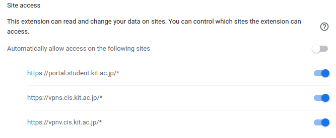

# allkicq (オールキック) 

Chrome Extension for **A**uto Fi**ll** **KI**T's **C**lass Evaluation **Q**uestionnaire

授業評価アンケートを自動入力するChromeの拡張機能

## インストール
1. [Release](https://github.com/yn4k4nishi/allkicq/releases)のAssetsからzipをダウンロードして解凍する
2. google chrome で [chrome://extensions/](chrome://extensions/) を開く
3. 右上の`Developer mode`をオンにする
4. 左上に出てくる`Load unpacked`を押して、解凍したフォルダを選択する。
5. allkicq が追加されているか確認する

## 使い方
拡張機能がインストールされている状態で授業評価アンケートのページを開くと自動入力されるので、
スクロールして`回答を保存する Save`を押すとアンケートの回答が終わる。

## Trouble Shooting
#### 拡張機能は入ったけど、自動入力されない場合
chrome://extensions/ を開いて、 allkicqのDetailsを開く
Site accessの欄から使用するVPN等に対応するもののチェックを入れる。
(全てにチェックを入れるの推奨)

